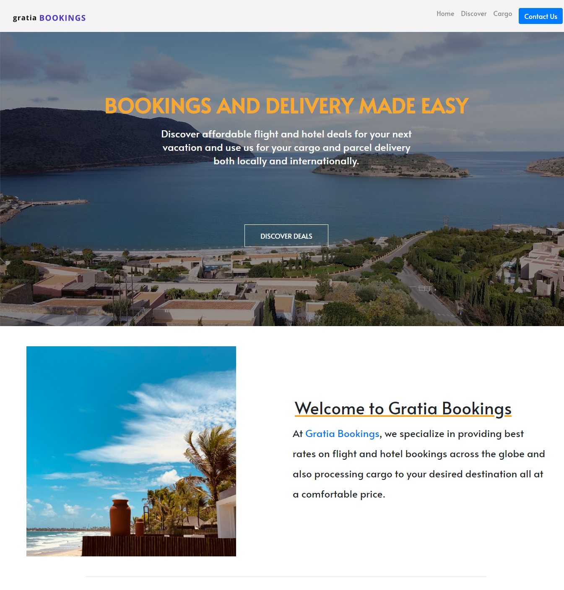

## Gratia Bookings Website

### Description
A static website built with react which enables cient have access to information such as flight and hotel packages, cargo delivery services and travel news.

### Technologies
* React
* ES6
* React Bootstrap

---

### Learning Process
This project solidified my understanding of the basics of react, creating stateless and stateful components, passing props, building layouts and making web page responsive across all devices, updating state and rendering data dynamically using array method map().

### Credits
Images

* [Unsplash- Travel](https://unsplash.com)
